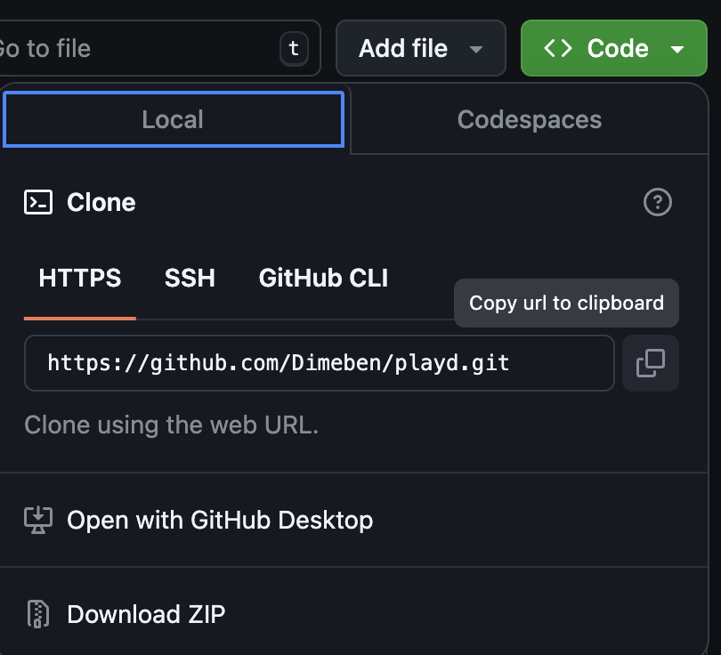

# Welcome to Playd 👋

## Tech Stack

- **JavaScript**
- **TypeScript**
- **React Native**
- **Expo**
- **Firebase**

## Downloading The Repo

1.  Click the green `Code` button and copy the URL <br>



2. Open your terminal app and change directory into the folder you wish to download to:

   ```bash
   cd Downloads
   ```

3. Download the repo:

   ```bash
   git clone https://github.com/Dimeben/playd.git
   ```

4. Change directory into the newly downloaded repo:

   ```bash
   cd playd
   ```

5. Open the repo:

   ```bash
   code .
   ```

## Get Started

1. Install dependencies

   ```bash
   npm install
   ```

2. Start the app

   ```bash
    npx expo start
   ```

In the output, you'll find options to open the app in a

- [development build](https://docs.expo.dev/develop/development-builds/introduction/)
- [Android emulator](https://docs.expo.dev/workflow/android-studio-emulator/)
- [iOS simulator](https://docs.expo.dev/workflow/ios-simulator/)
- [Expo Go](https://expo.dev/go), a limited sandbox for trying out app development with Expo

## Features

### Users

1. **Login/Sign-up**: Users can log in or sign up for an account to access the app.
2. **Browse DJs**: After logging in, users can see a list of available DJs to hire and can filter by location, genre and occasions.
3. **DJ Profile**: View individual DJ profiles, including their price, ratings, and other details.
4. **Booking a DJ**: Users can book DJs through the app by visiting the DJ's profile page and navigating to the booking page.
5. **Manage Bookings**: Users can manage their past and upcoming bookings.
6. **Leave Feedback**: After an event takes place, users can leave feedback for the DJ.
7. **Profile Management**: Users can edit their own profile, updating their details as needed.

### DJs

1. **Login/Sign-up**: DJs can log in or sign up to create their profile.
2. **View DJ Profile**: DJs can view their own profile to see what clients would see.
3. **Edit Profile**: DJs can update their profile details such as description, price, genres, etc.
4. **Manage Bookings**: DJs can manage all incoming and previous bookings, confirming or rejecting requests.
5. **View DJ List**: DJs can also browse other DJs, allowing them to check out the competition or network.
7. **Feedback Review**: DJs can view feedback left by clients after a gig and respond if necessary.
